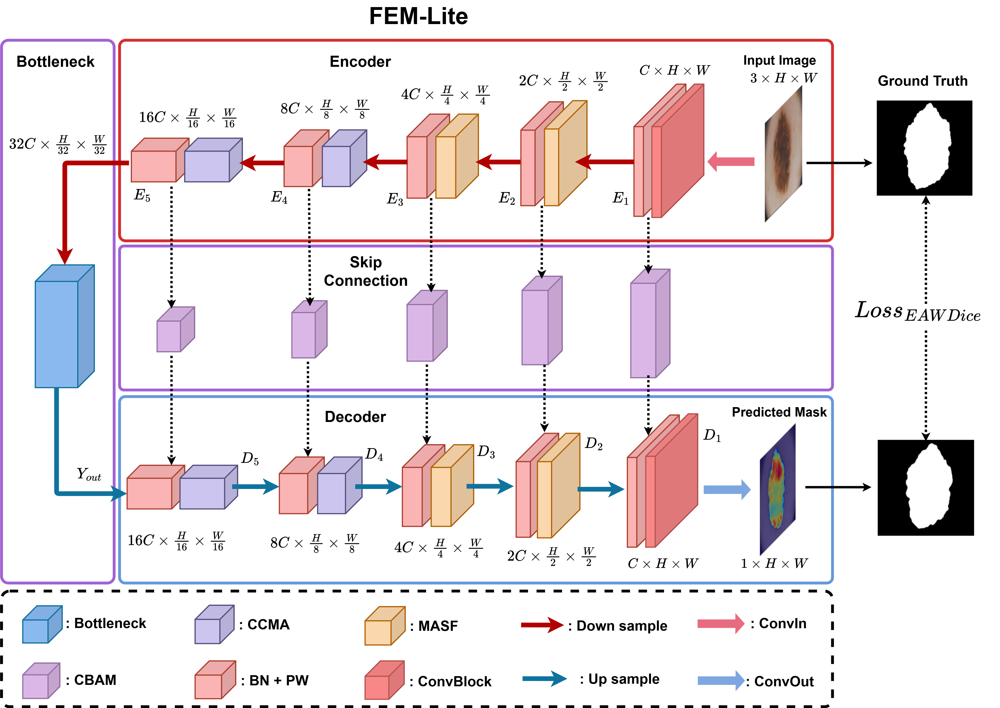

<h1 align="center">
  FEM-Lite: A lightweight frequency-enhanced Mamba network with cross-scale contextual attention and edge-aware weighted loss for medical image segmentation
</h1>

<p align="center">
  <b>Quang-Huy Nguyen</b><sup>1</sup>, 
  Minh-Ngoc Luong<sup>1</sup>, 
  Thi-Thao Tran<sup>1</sup>, 
  Van-Truong Pham<sup>1*</sup>
</p>

<p align="center">

<a href="https://doi.org/10.1016/j.imavis.2026.106111">
  
</a>

  <a href="https://www.sciencedirect.com/science/article/pii/S0262885626002180">
    
  </a>

  
  
  

  <a href="https://github.com/HUY-BK/FEM-Lite">
    
  </a>

  
  

</p>

---


## Abstract

In this study, we propose a lightweight model for medical image segmentation with only 0.92M parameters and 1.16 GFLOPs, designed to achieve an optimal balance between performance and computational cost. The core of our architecture named FEM-Lite, is the Frequency-Enhanced Mamba Visual State Space (FMVSS) block, which enables separate processing of low-frequency and high-frequency domains to enhance long-range context capture while preserving local details simultaneously. Additionally, the model features adaptively designed symmetric encoder–decoder blocks tailored to each processing stage: Mamba Axial Selective Fusion (MASF) at shallow layers leverages both global and local information. In contrast, Cross-scale Contextual Mamba Aggregation (CCMA) at deep layers learns multi-scale long-range context with minimal computational overhead. At the deepest layer, the bottleneck module integrates novel attention mechanisms-Cross-Domain Global Attention (CDGA) and Multi-Scale Attention (MSA)-to strengthen feature-dimension interactions. The Edge-Aware Weighted Dice (EAW-Dice) loss function introduced in this paper further enhances overall accuracy, particularly for boundary regions and challenging areas. Experimental results on five publicly available medical imaging datasets demonstrate that FEM-Lite, despite its minimal parameters and computational footprint, achieves superior performance compared to state-of-the-art models, validating its potential for deployment in real-time medical segmentation systems.

---

## Key Contributions

* FEM-Lite achieves precise medical image segmentation with 0.92M params, 1.16 GFLOPs.
* FMVSS block leverages 2D FFT spectral separation to enhance Mamba’s representation.
* Stage-specific MASF and CCMA blocks balance local details and multi-scale context.
* A hybrid bottleneck combines CDGA and MSA for multi-dimensional feature modeling.
* The novel EAW-Dice loss significantly improves boundary and segmentation precision.


---

## Network Architecture

<p align="center">

</p>

<p align="center">
Overview of the proposed FEM-Lite framework.
</p>

---


## Datasets

The proposed model is evaluated on **five publicly available medical image segmentation datasets**, covering three medical imaging domains.

| Dataset | Images | Domain | Access |
|:--------:|:------:|:------:|:------:|
| ISIC2018 | 2,594 | Skin Lesion | [Link](https://challenge.isic-archive.com/data/) |
| PH² | 200 | Skin Lesion | [Link](https://www.fc.up.pt/addi/ph2%20database.html) |
| BUSI | 647 | Breast Ultrasound | [Link](https://huggingface.co/datasets/MedOtter/BUSI) |
| Kvasir-SEG | 1,000 | Polyp Segmentation | [Link](https://datasets.simula.no/kvasir-seg/) |
| CVC-ClinicDB | 612 | Colonoscopy Polyp | [Link](https://polyp.grand-challenge.org/CVCClinicDB/) |


---

## Citation

If you find this work useful, please consider citing:

```bibtex
@article{NGUYEN2026106111,
title = {FEM-Lite: A lightweight frequency-enhanced Mamba network with cross-scale contextual attention and edge-aware weighted loss for medical image segmentation},
journal = {Image and Vision Computing},
volume = {174},
pages = {106111},
year = {2026},
issn = {0262-8856},
doi = {https://doi.org/10.1016/j.imavis.2026.106111},
url = {https://www.sciencedirect.com/science/article/pii/S0262885626002180},
author = {Quang-Huy Nguyen and Minh-Ngoc Luong and Thi-Thao Tran and Van-Truong Pham}
}

```

## Acknowledgement

This work was conducted at Hanoi University of Science and Technology.
